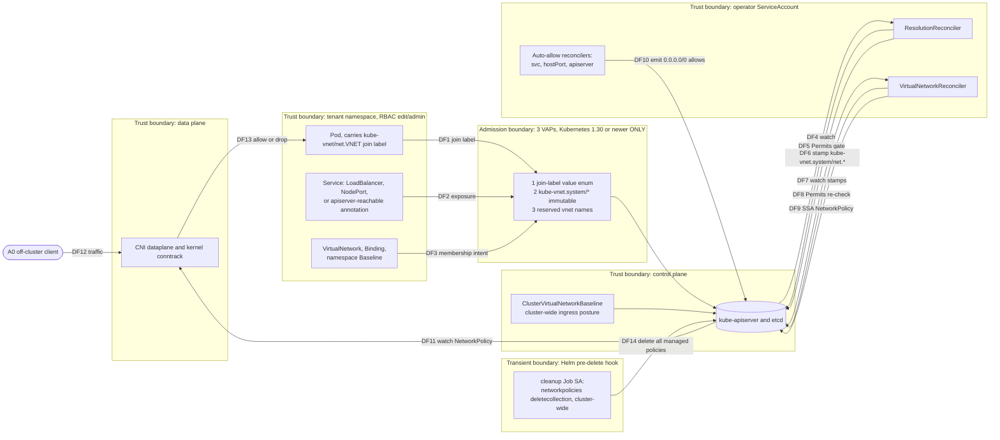
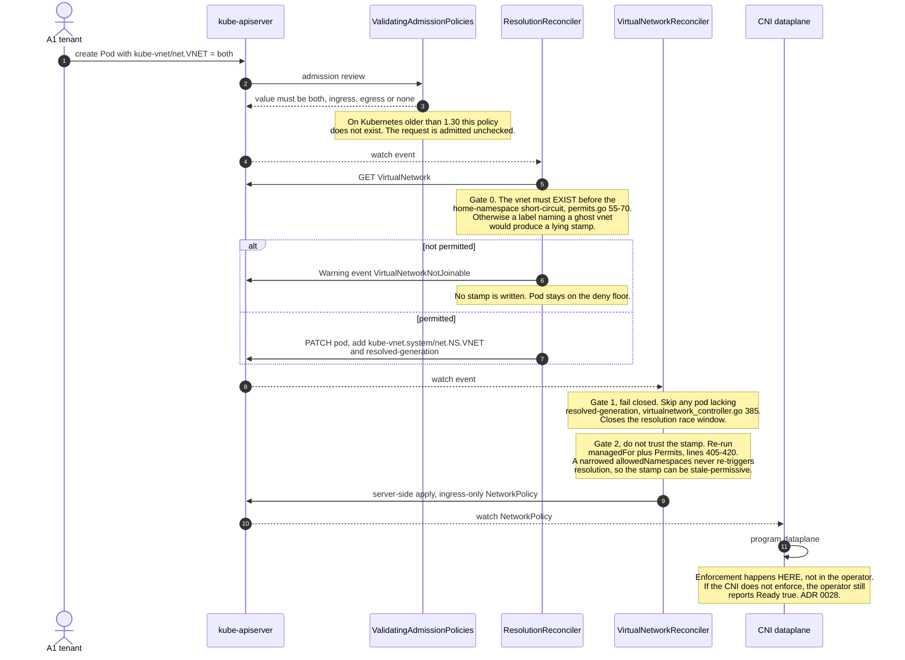

# Threat model (STRIDE)

A structured adversarial analysis of kube-vnet: assets, actors, trust boundaries, data flows, and a findings register. Its companion is [`security.md`](security.md) — that document is the operator-facing security *guide* (RBAC inventory, supply chain, hardening); this one is the *model*.

Every control below cites source (`file:line`) or an ADR. Claims were verified against the tree at v0.6.0; if you move code, fix the citations.

**Status**: first formal threat model, 2026-07-09. Scope: kube-vnet's own attack surface. Kubernetes' own boundaries (RBAC, admission, etcd) are assumed sound and are *not* re-litigated here.

---

## 1. Scope and load-bearing assumptions

kube-vnet is a **policy generator**, not an enforcement point. It converts a membership model into `networking.k8s.io/v1` NetworkPolicy objects. Everything downstream of that is Kubernetes and the CNI.

Three assumptions carry the entire model. Each fails **silently** — that is what makes them worth stating first.

| # | Assumption | If false | Signal you get |
|---|---|---|---|
| A-1 | **The CNI actually enforces NetworkPolicy.** | Every policy kube-vnet writes is decorative. Nothing is isolated. | **None.** The operator reports `Ready=True` regardless — [ADR 0028](../adr/0028-runtime-policy-verification.md):82. [`cni-pitfalls.md`](../guides/cni-pitfalls.md) enumerates CNIs that *claim* to enforce and silently don't (kube-router `ipMasq`, Calico Felix down, Cilium identity lag). |
| A-2 | **Kubernetes ≥ 1.30.** | All three ValidatingAdmissionPolicies render *nothing* (`charts/kube-vnet/templates/system-vnet-vap.yaml:49` and siblings). Operator-owned labels, reserved vnet names, and join-label values become unprotected at admission; only drift-correction remains, which is a race, not a boundary. | Since v0.6.0, `helm install` prints a warning. Previously: none. See **F-02**. |
| A-3 | **Tenants do not hold `patch namespace`.** | A tenant sets `kube-vnet/disabled=true` on their own namespace (`internal/controller/namespace.go:12`) and opts out of *all* isolation — baseline included. | None. This is ordinary Kubernetes RBAC; kube-vnet cannot police it. See **F-04**. |

**Explicitly out of scope** (unchanged from [`security.md`](security.md)): egress exfiltration ([ADR 0025](../adr/0025-ingress-isolation-rename-egress-unrestricted.md) — the baseline is `PolicyTypes: [Ingress]` only, `internal/controller/baseline.go:45`), L7/application-layer attacks, in-pod compromise, kernel/container escape, hostNetwork pods (outside NetworkPolicy entirely), and cluster-admin compromise.

---

## 2. Assets

| Asset | Why it matters |
|---|---|
| **The deny-all baseline** (`kube-vnet.base`, one per managed namespace) | The isolation floor. Its absence = default-allow. |
| **Operator-stamped membership labels** (`kube-vnet.system/net.*`) | The *only* thing generated policies select on. Forging one = forging membership. |
| **The generated NetworkPolicy set** | The realised isolation posture. |
| **`ClusterVirtualNetworkBaseline/default`** | Cluster-wide default ingress posture. One object; edits reach every namespace. |
| **Operator ServiceAccount token** | Cluster-wide NetworkPolicy CRUD + `pods: patch`. |
| **Cleanup-hook ServiceAccount token** | Cluster-wide `networkpolicies: deletecollection` (transient). |

---

## 3. Actors and capabilities

Columns state what each actor can do **without** kube-vnet, so the model never takes credit for a boundary Kubernetes already enforced.

| Actor | Baseline Kubernetes capability | Additional leverage kube-vnet grants |
|---|---|---|
| **A0 · Off-cluster client** | Reach whatever is exposed (LoadBalancer, NodePort, hostPort). | Auto-allow families open `0.0.0.0/0` on the exposed port (**F-03**). |
| **A1 · Tenant** (`edit` in one namespace) | Create Pods/Services. In a **stock cluster the built-in `edit` role already grants NetworkPolicy write** — verify yours with `kubectl get clusterrole edit -o yaml`. | Join label, `apiserver-reachable` annotation, namespace `VirtualNetworkBaseline`. Can self-expose; **cannot** self-grant cross-namespace membership (§5, Gate 2). |
| **A2 · Namespace admin** (+ `patch namespace`) | Everything A1 has. | `kube-vnet/disabled=true` → total opt-out (**F-04**). Delete `kube-vnet.base` → restore-window (**F-05**). |
| **A3 · Cluster admin** | Everything. | — (out of scope; can uninstall the operator.) |
| **A4 · Compromised operator SA** | — | Rewrite/delete **any** NetworkPolicy cluster-wide (`config/rbac/role.yaml:101`) and relabel **any** pod (`:26`). Total isolation bypass (**F-10**). |
| **A5 · Compromised cleanup-hook SA** (transient, during `helm uninstall`) | — | `deletecollection` on networkpolicies cluster-wide (`charts/kube-vnet/templates/cleanup-hook.yaml:56`) → collapse the cluster to default-allow (**F-01**). |
| **A6 · Compromised node / CNI** | Already owns the dataplane. | — (kube-vnet cannot defend below its own output.) |

---

## 4. Component / data-flow diagram

Subgraphs are trust boundaries. Flows crossing a boundary are where STRIDE is applied (§6).

---

## 5. Enforcement sequence, with the fail-closed gates

The model's strongest property is that **the stamp is never trusted on its own**. `Permits()` runs twice, in two different controllers, and the second run re-reads current cluster state. This is easy to lose in a refactor — hence the diagram.

Gate 2 is worth reading in source (`internal/controller/virtualnetwork_controller.go:399-420`), because its comment states the exact threat:

> *"The membership policy must not trust a stamp the CURRENT cluster state wouldn't grant"* — a narrowed `allowedNamespaces` never re-triggers resolution, so a stamp written while a namespace *was* permitted survives the revocation. Gate 2 catches it.

> **Note the exemption.** Gate 2 skips the re-check for system vnets (`p.Namespace != vnet.Namespace && !systemVnet`, `:412`). This is sound: the per-namespace `namespace` vnet is same-namespace by construction, and the `cluster` vnet is `allowedNamespaces.all: true`, so a forged `net.cluster` stamp grants nothing a tenant could not obtain legitimately with a join label.

---

## 6. STRIDE analysis

Severity is *residual* — after the listed control. **Accepted** = a deliberate design trade-off with a recorded rationale. **Open** = a gap with a proposed remediation.

### S — Spoofing (forging identity or membership)

| Threat | Actor | Control | Residual | Status |
|---|---|---|---|---|
| Forge a `kube-vnet.system/net.*` stamp on own pod to fake membership | A1 | system-labels VAP denies any non-operator write to `kube-vnet.system/*` (`system-labels-vap.yaml`); resolution strips unauthorized stamps; **Gate 2** re-checks `Permits` for cross-namespace joins | Low on ≥1.30. On <1.30 a stamp survives until the next reconcile, but Gate 2 still denies cross-namespace membership, so the gain is limited to self-exposure the tenant could get anyway | Accepted |
| Create a `VirtualNetwork` named `cluster`/`namespace`, or one labelled `kube-vnet.system/managed-by`, to impersonate a system vnet | A1/A2 | system-vnet VAP (reserved names + label) | Low on ≥1.30; **unprotected on <1.30** | **F-02** |
| Label a hostile NetworkPolicy `app.kubernetes.io/managed-by=kube-vnet` to be treated as operator-owned | A1 | That key is **never** an ownership signal — "INFORMATIONAL ONLY" (`internal/controller/policy_generator.go:26`), enforced by a regression test. Only the VAP-protected `kube-vnet.system/managed-by` is authoritative | None | Accepted |

### T — Tampering (altering the isolation posture)

| Threat | Actor | Control | Residual | Status |
|---|---|---|---|---|
| `kubectl delete networkpolicy kube-vnet.base` | A2 | Drift correction re-applies; `PolicyRestored` Warning event | **Traffic flows during the delete→restore window** (seconds). Defeated entirely if the operator is also stopped | **F-05** (Accepted; `AdminNetworkPolicy` is the real fix — [ADR 0019](../adr/0019-baseline-durability.md)) |
| Edit `ClusterVirtualNetworkBaseline` to loosen every namespace at once | A3 | Deliberately **not** aggregated into `admin`/`edit`/`view` — a cluster-admin must bind it explicitly (`rbac-aggregated.yaml`) | Requires cluster-scoped grant | Accepted |
| Tighten a vnet, but established connections keep flowing | A1 | None available. NetworkPolicy is evaluated at SYN time only; conntrack `ESTABLISHED` entries are never re-evaluated (default timeout ~5 days, [`faq.md`](../faq.md):172) | Real gap between "policy applied" and "policy effective"; remediation is a pod restart | **F-07** (Accepted, universal to NetworkPolicy) |
| Delete every managed policy via the uninstall hook's SA | A5 | Hook SA is short-lived (`hook-succeeded` + `ttlSecondsAfterFinished: 60`) | RBAC **cannot** express a label selector, so the SA's `deletecollection` is cluster-wide regardless of the `--selector` in the Job's argv | **F-01** (Accepted; no clean RBAC fix) |

### R — Repudiation (attribution)

| Threat | Actor | Control | Residual | Status |
|---|---|---|---|---|
| Delete a policy, deny having done so | A2 | kube-vnet **detects** (`PolicyRestored` Warning event, `metrics-and-events.md`) but does not **attribute** — the event names the policy, not the principal | Attribution requires the Kubernetes audit log. kube-vnet cannot and should not duplicate it | Accepted (document: enable audit logging) |
| No published vulnerability-reporting path | — | — | GitHub surfaced no `SECURITY.md` | **F-08** — fixed, see `/SECURITY.md` |

### I — Information disclosure

| Threat | Actor | Control | Residual | Status |
|---|---|---|---|---|
| Auto-allow opens a pod's port to the whole internet | A0 | Opt-out annotation `kube-vnet/external-allow=false`; `--apiserver-source-cidr` narrows the apiserver family | Default-on for LoadBalancer/NodePort Services (`external_allow_controller.go:299`) and hostPort pods (`hostport_controller.go:195`), both `0.0.0.0/0` | **F-03** (Accepted, ADR 0038/0040) |
| Read foreign-namespace pod names via `status.members` / `Degraded` messages on a vnet | A1 with `view` in the vnet's **home** namespace | None by design — surfacing members is what `status.members` is *for*. Not an enumeration primitive: the joining namespace must label its own pods first | Pod names (not contents) of joining namespaces are visible to home-namespace viewers; the `Degraded` path also names pods from namespaces the vnet **denied** | **F-06** (Low, Accepted) |

### D — Denial of service

| Threat | Actor | Control | Residual | Status |
|---|---|---|---|---|
| Edit `ClusterVirtualNetworkBaseline` → every pod in the cluster re-resolves | A3 | — | Inherent: it is a cluster-wide posture object | **F-09** (Accepted; treat CVNB edits as change-controlled) |
| Policy explosion: policies scale with (vnets × member namespaces) | A1/A2 | Naming is deterministic and swept; no unbounded growth per pod | apiserver/etcd load grows with vnet fan-out | F-09 |
| Event flood from a delete/restore loop | A2 | Detectable: `KubeVnetPolicyRestoredRepeatedly` alert ([`operations.md`](../guides/operations.md)) | Noise, not outage | F-09 |
| Stop the operator | A3 | **Existing policies persist and keep being enforced** — the enforcement state lives in the apiserver, not the operator. New pods go unstamped, i.e. isolated | Fail-**closed**. Only change-propagation stops | Accepted (strength) |

### E — Elevation of privilege

| Threat | Actor | Control | Residual | Status |
|---|---|---|---|---|
| Self-grant membership in a foreign namespace's vnet | A1 | `Permits()` requires the vnet's own `spec.allowedNamespaces` to permit the joiner (`permits.go`), enforced **twice** (§5) | A tenant can only *request*; the vnet owner authorizes | None — core boundary, holds |
| Opt own namespace out of all isolation | A2 | None — `kube-vnet/disabled=true` is honored by design | Whoever holds `patch namespace` holds this switch | **F-04** (Accepted; withhold the RBAC) |
| Open own pods to `0.0.0.0/0` via `kube-vnet/apiserver-reachable=true` | A1 | Annotation is an explicit opt-in escape hatch (`namespace.go:39`) | **Not** an escalation in a stock cluster (built-in `edit` already grants NetworkPolicy write). **It is** an escalation in clusters that deliberately strip NetworkPolicy rights from tenants | **F-03** (Open for hardened clusters) |
| Compromise the operator SA | A4 | Least privilege *within* its job: no `secrets`, no `namespaces` write, no pod `create`/`delete` | Still cluster-wide NetworkPolicy CRUD + `pods: patch` → total isolation bypass | **F-10** (Accepted, inherent to the operator pattern) |

---

## 7. Findings register

| # | Finding | STRIDE | Severity | Status |
|---|---|---|---|---|
| **F-01** | Cleanup-hook SA holds cluster-wide `networkpolicies: list,delete,deletecollection` (`cleanup-hook.yaml:56`) plus `deployments: delete`. The label selector lives only in the Job's `kubectl --selector` argv; **RBAC cannot express label selectors**, so the token can drop *every* NetworkPolicy in the cluster. | T, E | High impact / low likelihood (transient, uninstall-only) | **Accepted.** No clean RBAC fix. Mitigations: `cleanup.enabled=false` if you accept manual cleanup ([ADR 0036](../adr/0036-helm-pre-delete-hook-cleanup.md)); the hook and its RBAC are deleted on success. |
| **F-02** | On Kubernetes < 1.30 all three VAPs render nothing. Operator-owned labels, reserved vnet names, and join-label values are unprotected at admission. | S, T | Medium | **Fixed (partially).** `helm install` now warns (`NOTES.txt`). The underlying gap is inherent — VAP is GA only in 1.30. Drift-correction remains as a race-y fallback. |
| **F-03** | Three default-on `0.0.0.0/0` ingress openings, all tenant-triggerable: LoadBalancer/NodePort Service (`external_allow_controller.go:299`), hostPort pod (`hostport_controller.go:195`), `kube-vnet/apiserver-reachable=true` (`apiserver_reachable_controller.go:432`, narrowable via `--apiserver-source-cidr`). | I, E | Medium | **Accepted** as designed (ADR 0038/0040/0041) — the alternative is breaking every ingress controller by default. **Open** for hardened clusters: if you strip NetworkPolicy rights from tenants, these annotations reintroduce the capability. Set `kube-vnet/external-allow=false` at namespace scope, and audit `kube-vnet/apiserver-reachable`. |
| **F-04** | `kube-vnet/disabled=true` on a Namespace disables all isolation there; needs only `patch namespace`. | E | Medium | **Accepted.** Withhold `patch namespace` from tenants. Assumption A-3. |
| **F-05** | Delete→restore window on any operator-managed policy. | T | Medium | **Accepted.** `AdminNetworkPolicy` would make the floor RBAC-proof; tracked in [ADR 0019](../adr/0019-baseline-durability.md) / [ADR 0028](../adr/0028-runtime-policy-verification.md). |
| **F-06** | A vnet's `status.members` lists pod names grouped by namespace (`virtualnetwork_controller.go:425`), and its `Degraded` message formats failures as `<ns>/<pod>:<reason>` (`summarizeInvalid`). Because the chart aggregates vnet `get/list/watch` into the built-in `view` role, **anyone with `view` in the vnet's home namespace reads pod names from foreign namespaces**, without holding pod-read there. | I | Low | **Accepted.** It is not an enumeration primitive: a foreign pod appears only because *its own* namespace put it there (join label, binding, or baseline) — the other side always acts first, so the vnet owner cannot sweep arbitrary namespaces. What leaks is metadata (names), not contents, and `Degraded` is capped at three entries plus a count. Against that, `status.members` is the field's entire purpose: a vnet owner must be able to see who joined their network. Residual risk, stated plainly: pod names disclose more than people expect (StatefulSet ordinals reveal replica counts; names may carry customer or environment identifiers), and the `Degraded` path names pods from namespaces the vnet **denied** (`ReasonNamespaceNotAllowed`) — namespaces with no authorized relationship to it. Operator mitigation if that matters in your cluster: `rbac.aggregate=false`, which makes the chart ship **no** ClusterRoles at all (the flag gates the whole file, including the otherwise-unbound `clustervirtualnetworkbaselines` editor/viewer pair) — you then author vnet RBAC yourself and simply do not fold vnet read into the wide `view` audience. |
| **F-07** | conntrack `ESTABLISHED` amnesty: tightening isolation does not sever open flows (~5-day default). | T | Medium | **Accepted.** Universal to NetworkPolicy on every CNI ([`faq.md`](../faq.md):172). Remediation: restart pods after tightening. |
| **F-08** | No `SECURITY.md` → GitHub advertised no reporting path. | R | Low | **Fixed.** See [`/SECURITY.md`](../../SECURITY.md). |
| **F-09** | DoS surfaces: CVNB edit re-resolves all pods; policy count scales with vnet × namespace fan-out; restore-loop event floods. | D | Low | **Accepted.** Treat the CVNB as a change-controlled object; alert on `KubeVnetPolicyRestoredRepeatedly`. |
| **F-10** | Operator SA: cluster-wide NetworkPolicy CRUD + `pods: patch`. Compromise = total isolation bypass. | E | High impact / inherent | **Accepted.** Inherent to any NetworkPolicy-generating operator. Minimised: no `secrets`, no `namespaces` write, no pod create/delete. Protect the SA token as you would cluster-admin. |

---

## 8. Properties that hold (what this model *does* defend)

A threat model that only lists holes is not honest. These were verified in source:

- **Membership cannot be self-granted across namespaces.** `Permits()` is checked twice, in two controllers, and the second check re-reads live state (`virtualnetwork_controller.go:405-420`). A stamp written while a namespace was permitted does **not** survive revocation of `allowedNamespaces`.
- **A stamp never lies about a vnet that does not exist.** Existence is verified *before* the home-namespace short-circuit (`permits.go:55-70`).
- **The resolution race is fail-closed.** Pods without `resolved-generation` are excluded from policy generation (`virtualnetwork_controller.go:385`) — an unresolved pod is isolated, never over-permissive.
- **Operator downtime is fail-closed.** Policies live in the apiserver; the CNI keeps enforcing. Only change-propagation stops.
- **Ownership cannot be spoofed by a convention label.** `app.kubernetes.io/managed-by` is informational and is never a sweep/delete signal (`policy_generator.go:26`), pinned by a regression test.
- **The cluster-wide posture object is not tenant-reachable.** `ClusterVirtualNetworkBaseline` is deliberately excluded from the aggregated `admin`/`edit` roles.

---

## 9. Maintaining this document

- Re-verify the `file:line` citations whenever `permits.go`, `resolution_controller.go`, or `virtualnetwork_controller.go` change. A threat model with stale citations is worse than none.
- Any new `0.0.0.0/0` emitter is a **new row in §6 (I/E)** and probably a new finding.
- Any new user-writable `kube-vnet/*` key crosses the tenant→operator boundary: add it to §3 and check whether it widens ingress.
- Removing a `Permits()` call, or the `resolved-generation` gate, invalidates §8. Both are regression-tested; keep them that way.

## References

- [`security.md`](security.md) — the operator-facing security guide (RBAC inventory, supply chain, hardening)
- [`../guides/cni-pitfalls.md`](../guides/cni-pitfalls.md) — assumption A-1 in practice
- [ADR 0019](../adr/0019-baseline-durability.md) — drift correction and its limits
- [ADR 0025](../adr/0025-ingress-isolation-rename-egress-unrestricted.md) — the ingress-only scope and "the false-security trap"
- [ADR 0028](../adr/0028-runtime-policy-verification.md) — why `Ready=True` does not mean "enforced"
- [ADR 0031](../adr/0031-baseline-tier-resolution.md) — the trust gradient, fail-closed intersection
- [ADR 0036](../adr/0036-helm-pre-delete-hook-cleanup.md) — the cleanup hook and its RBAC
- [ADR 0037](../adr/0037-system-prefix-convention-for-operator-owned-keys.md) — `kube-vnet.system/` tamper-protection
